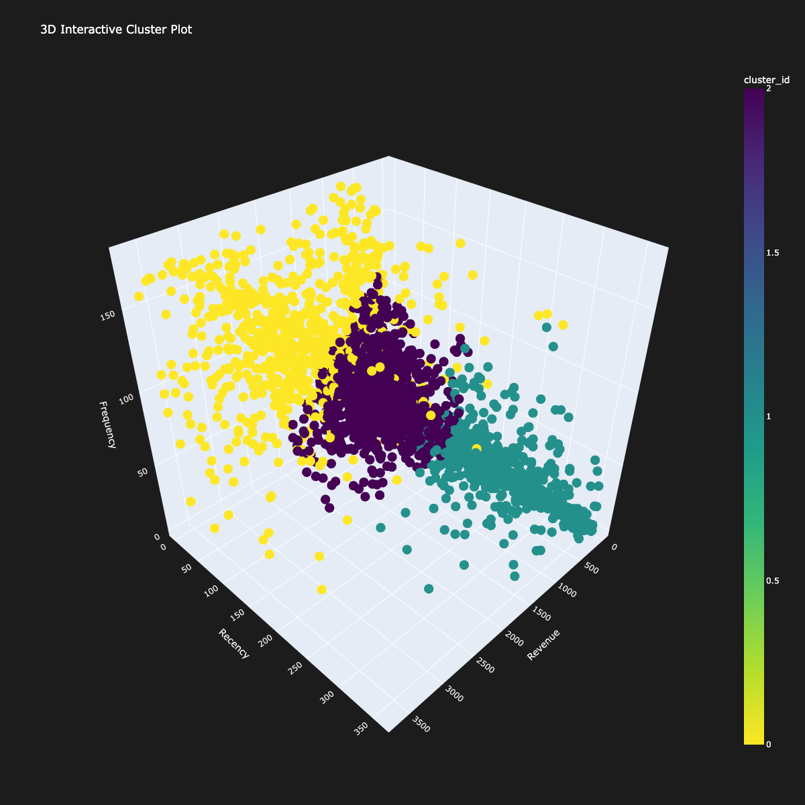

# Customer Segmentation using K-Means Clustering for Targeted Marketing

Performing customer segmentation using unsupervised clustering on the Online Retail dataset. This analysis leverages RFM (Recency, Frequency, Monetary) metrics to identify distinct customer groups, enabling targeted marketing and strategic business decisions.

 

---
 

## Table of Contents
- [Objective](#objective)
- [Dataset](#dataset)
- [Methodology](#methodology)
- [Key Findings from K-Means Clustering](#key-findings-from-k-means-clustering)
- [Key Findings from Hierarchical Clustering](#key-findings-from-hierarchical-clustering)
- [Final Recommendations](#final-recommendations)
- [How to Run This Project](#how-to-run-this-project)

---
 

## Objective

In today’s competitive e-commerce landscape, personalized marketing is essential. This project segments customers into meaningful clusters based on their purchasing behavior to help a business:

-   🎨 **Design targeted marketing campaigns** for specific customer groups.
-   🏆 **Identify high-value customers** to prioritize for loyalty programs.
-   📈 **Uncover purchasing trends** across different regions.
-   📦 **Improve inventory planning** by understanding customer demand.

---
 

## Dataset

The analysis is performed on the **Online Retail Dataset**, a transactional dataset from a UK-based non-store online retailer.

-   **Source:** [UCI Machine Learning Repository](https://archive.ics.uci.edu/ml/datasets/online+retail)
-   **Size:** 541,909 rows, 8 columns
-   **Key Attributes:** `InvoiceNo`, `StockCode`, `Description`, `Quantity`, `InvoiceDate`, `UnitPrice`, `CustomerID`, `Country`.

---
 

## Methodology

The project follows a structured data analysis plan:

1.  **Data Cleaning:** Handled missing `CustomerID` values, removed duplicate records, and filtered out transactional anomalies like returns (negative quantity).
2.  **Feature Engineering:** Calculated **RFM (Recency, Frequency, Monetary)** metrics for each customer.
    -   **Recency:** Days since the customer's last purchase.
    -   **Frequency:** Total number of transactions made by the customer.
    -   **Monetary:** Total revenue contributed by the customer.
3.  **Outlier Removal:** Applied the IQR method to remove extreme outliers from the RFM features to ensure model stability.
4.  **Data Scaling:** Standardized the RFM features using `StandardScaler` to give them equal importance in the clustering algorithm.
5.  **Clustering:**
    -   **K-Means:** Applied the K-Means algorithm. The optimal number of clusters was determined to be **3** using the Elbow Method and Silhouette Score analysis.
    -   **Hierarchical Clustering:** Applied agglomerative hierarchical clustering with complete linkage to provide an alternative segmentation perspective.

---
 

## Key Findings from K-Means Clustering

The K-Means model excelled at creating highly actionable, time-sensitive segments ideal for marketing campaigns.

| Cluster | Identity | Characteristics | Actionable Insights |
| :--- | :--- | :--- | :--- |
| **Cluster 0** | 🏆 **Champions (High-Value)** | High Frequency, High Spending, Recent Purchasers. | Reward with VIP programs, seek feedback, and use personalized communication. |
| **Cluster 1** | 🌱 **Potential Loyalists** | Recent Purchasers, Low-to-Mid Frequency & Spend. | Encourage repeat purchases with follow-up offers and personalized recommendations to build habits. |
| **Cluster 2** | 💔 **At-Risk / Lapsed** | High Recency (long time since last purchase), Low Frequency & Spend. | Target with "We Miss You!" win-back campaigns, special offers, and churn-reason surveys. |

---
 

## Key Findings from Hierarchical Clustering

Hierarchical Clustering provided a strategic overview based on purchasing power, ignoring recency as the primary separator.

| Cluster | Identity | Characteristics | Actionable Insights |
| :--- | :--- | :--- | :--- |
| **Cluster 0** | 💰 **Big Spenders** | Highest Revenue, Moderate-to-High Frequency. Spans all recency levels. | Sub-segment by recency. Target active spenders with VIP programs and lapsed ones with high-incentive win-back offers. |
| **Cluster 1** | 👍 **Active Regulars** | Highest Frequency, Low-to-Mid Revenue. Mostly recent shoppers. | Goal: Increase Average Order Value (AOV). Promote bundles, upsells, and "free shipping" thresholds. |
| **Cluster 2** | 🚶 **Low-Value Shoppers** | Lowest Spending and Frequency. | Minimize marketing investment. Use low-cost, automated communication (e.g., general newsletters). |

---
 

## Final Recommendations

By leveraging insights from both models, the retailer can move beyond a one-size-fits-all approach.

-   **Tactical Marketing (K-Means):** Use the K-Means segments (Champions, Potential, At-Risk) for day-to-day marketing actions focused on the customer lifecycle. This provides a clear framework for retention and growth campaigns.
-   **Strategic Planning (Hierarchical):** Use the Hierarchical segments (Big Spenders, Loyal Regulars) to guide long-term decisions on product offerings, inventory management for high-frequency items, and overall loyalty program design.

Together, these models provide a powerful, data-driven foundation to enhance customer relationships, drive sales, and optimize the overall business strategy.

---
 
